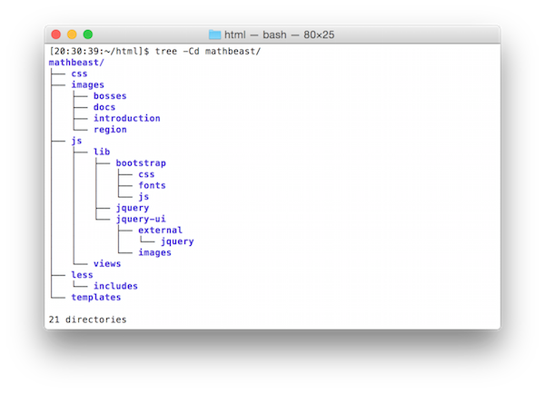

#How to contribute
This guide explains in detail how MathBeast is built and how you need to set up
your development environment to start contributing.

##Directory Structure

##Libraries
###Custom Libraries
- [Mathbeast](https://github.com/PhoenixJSMeetup/mathbeast/blob/master/js/lib/mathbeast.js)

###Third-Party Libraries
- [Bootstrap](http://getbootstrap.com/)
- [jQuery](http://jquery.com/)
- [jQuery UI](http://jqueryui.com/)
- [require.js](http://requirejs.org/)
- [require.js/text](https://github.com/requirejs/text)
- [backbone.js](http://backbonejs.org/)

##Code Conventions
- Use two spaces to indent HTML, CSS, Less, and JavaScript code.
- Follow the conventions provided on [Crockford's guide](http://javascript.crockford.com/code.html)

##Code Review Workflow (GitHub Flow)
- Contributing is as easy as 1, 2, 3. 
1. Fork the Mathbeast repo.
2. Create a feature branch from the current development branch (i.e. mvp4) and contribute code to the feature branch.
3. When you're done working on a feature, push your commited code to your forked repository and create a pull request. Once a pull request is created, an administrator will review your code and merge it into the development branch.

##Set Up Development Environment
You won't need an http server, but you'll need to compile Less files into CSS.
Below are instructions on how to set up your environment to run gulp tasks.

1. Make sure you have these installed
  - [node.js](http://nodejs.org/)
  - [git](http://git-scm.com/)
  - [gulp](http://gulpjs.com/)
2. Clone this repository into your local machine using the terminal (mac) or Gitbash (PC) `git clone https://github.com/PhoenixJSMeetup/mathbeast.git`
3. CD to the folder `cd mathbeast`
4. Run `npm install` in terminal to install the project dependencies

For more help setting up a comprehensive Gulp.js workflow, check out [Web Project Workflows with Gulp.js, Git, and Browserify](http://www.lynda.com/Web-Web-Design-tutorials/Web-Project-Workflows-Gulpjs-Git-Browserify/154416-2.html).

##Backbone Files
@TODO: Explain what each of the files below do.
- js/app.js
- js/main.js
- js/app.js
- js/views/appView.js
- js/views/View.js
- js/views/introductionView.js
- js/views/mainView.js
- js/views/outroView.js
- js/views/regionView.js
- js/views/settingView.js
